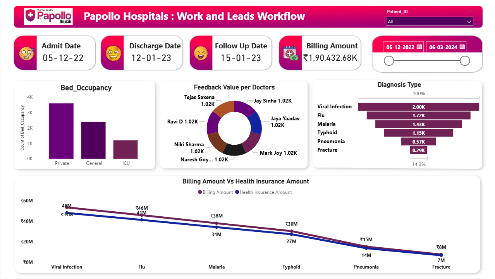

# Papollo Hospitals Dashboard
## 1. Project Title / Headline
A business intelligence dashboard for Papollo Hospitals, focusing on work and leads workflow, providing insights into patient admissions, discharges, diagnoses, billing, and doctor performance.

## 2. Short Description / Purpose
The Papollo Hospitals: Work and Leads Workflow Dashboard is an interactive report designed to present comprehensive operational and financial metrics. It helps hospital management monitor key performance indicators related to patient flow, bed occupancy, diagnosis trends, financial transactions, and doctor feedback, enabling data-driven decision-making to optimize hospital operations.

## 3. Tech Stack
This dashboard was developed using:
- **Power BI Desktop** – Main data visualization platform for interactive report building
- **Power Query** – Used for cleaning and transforming raw transactional data

## 4. Data Source
- Source: Papollo Healthcare Dataset from Papollo-Healtcare-Dataset.xlsx - Sheet1.csv
- Period: December 2022 to March 2024 
- Volume: Multiple patient records and transactions
- Key Fields: Patient_ID, Admit_Date, Discharge_Date, Diagnosis, Bed_Occupancy, Test, Doctor, Followup Date, Feedback, Billing Amount, Health Insurance Amount

## 5. Features / Highlights
### • Business Problem
Papollo Hospitals needed a data-driven system to efficiently track patient journeys, manage bed occupancy, understand diagnosis patterns, monitor financial performance, and assess doctor feedback to improve overall workflow and patient care.
### • Goal of the Dashboard
- To offer a comprehensive view of hospital operations across:
- Patient admission, discharge, and follow-up tracking
- Bed occupancy analysis across different types (Private, General, ICU)
- Insights into common diagnosis types
- Financial performance comparison between billing and health insurance amounts
- Doctor performance based on patient feedback

### • Walkthrough of Key Visuals
#### KPI Cards (Top Row)
- **Admit Date** : 05-12-22
- **Discharge Date** : 12-01-23
- **Follow Up Date** : 15-01-23
- **Billing Amount** : $1,90,432.68K

#### Operational Insights
- **Bed Occupancy** : Bar chart showing counts for Private, General, and ICU bed types.
- **Feedback Value** : Donut chart displaying feedback values (e.g., Tejas Saxena 1.02K, Jay Sinha 1.02K, Jaya Yaadav 1.02K, Mark Joy 1.02K, Niki Sharma 1.02K, Naresh Goyenka 1.02K).
- **Diagnosis Type** : Bar chart showing the frequency of different diagnoses such as Viral Infection, Flu, Malaria, Typhoid, Pneumonia, and Fracture.

#### Financial Analysis
Billing Amount Vs Health Insurance Amount: Line chart comparing billing and health insurance amounts across different diagnoses.

#### • Business Impact & Insights
- **Operational Efficiency** : Helps in optimizing bed allocation and managing patient flow more effectively.
- **Doctor Performance** : Provides a quick overview of doctor feedback, potentially highlighting areas for recognition or improvement.
- **Disease Management** : Identifies prevalent diagnosis types, aiding in resource allocation and preventive care planning.
- **Financial Health** : Offers a clear comparison of billing versus insurance payouts, crucial for revenue cycle management and financial forecasting.

## 6. Screenshots / Demos

